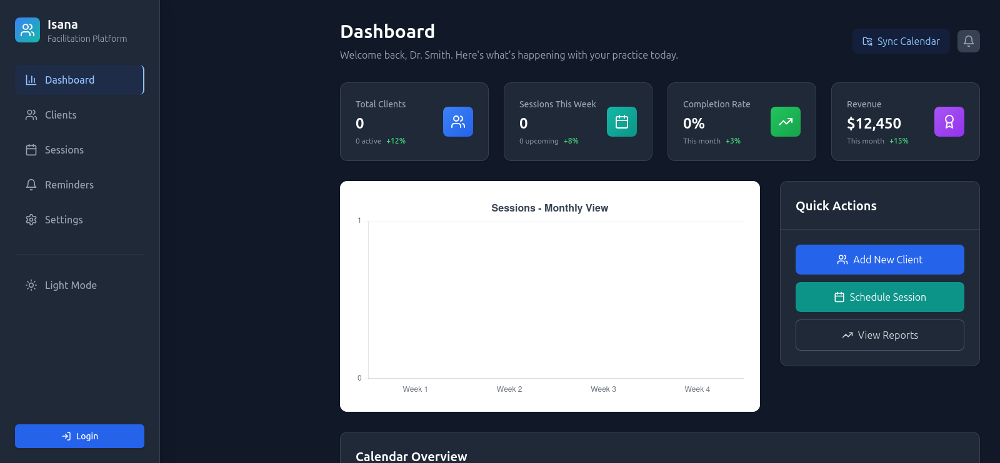

# Isana Facilitation Platform

A comprehensive React-based web application designed for therapists and counselors to manage clients and sessions with a calm, professional UI/UX.

[Try Isana Live](https://yosephdev.github.io/isana-facilitation/) | [View Demo](#features)



## 🌟 Features

### Core Functionality

- **Client Management**: Complete client profiles with contact information, treatment goals, and session history
- **Session Management**: Schedule, track, and document therapy sessions with detailed notes
- **Dashboard Analytics**: Real-time insights into practice metrics and performance
- **Calendar Integration**: Full calendar view with drag-and-drop scheduling
- **Notes System**: Auto-saving session notes with PDF export capabilities
- **Reminders**: Client-specific reminders and follow-up notifications

### Technical Features

- **TypeScript**: Full type safety across the application
- **State Management**: Zustand for efficient state management
- **Lazy Loading**: Code-splitting for optimal performance
- **Responsive Design**: Mobile-first design with Tailwind CSS
- **Accessibility**: WCAG-compliant with proper ARIA labels and keyboard navigation
- **Modern UI**: Loading skeletons, animations, and micro-interactions

## 🚀 Quick Start

### Prerequisites

- Node.js 18+
- npm or yarn

### Installation

1. **Clone the repository**

   ```bash
   git clone https://github.com/yosephdev/isana-facilitation
   cd isana-facilitation-platform
   ```

2. **Install dependencies**

   ```bash
   npm install
   ```

3. **Set up environment variables**

   ```bash
   cp .env.example .env
   # Edit .env with your configuration
   ```

4. **Start development server**

   ```bash
   npm run dev
   ```

5. **Build for production**

   ```bash
   npm run build
   ```

## 📁 Project Structure

```
src/
├── components/           # Reusable UI components
│   ├── ui/              # Base UI components (Modal, LoadingSkeleton)
│   ├── calendar/        # Calendar-specific components
│   └── analytics/       # Chart and analytics components
├── pages/               # Page-level components
├── hooks/               # Custom React hooks
│   ├── useAuth.ts       # Authentication hook
│   ├── useCalendar.ts   # Calendar management hook
│   └── useNotes.ts      # Notes management hook
├── services/            # API and external service integrations
│   ├── authService.ts   # Authentication service
│   ├── calendarService.ts # Calendar sync service
│   └── notesService.ts  # Notes and PDF export service
├── store/               # State management
│   └── useAppStore.ts   # Zustand store
├── types/               # TypeScript type definitions
├── data/                # Mock data and constants
└── utils/               # Utility functions
```

## 🎨 Component Architecture

### Core Components

- **Navigation**: Responsive sidebar navigation with mobile support
- **Dashboard**: Analytics dashboard with charts and quick actions
- **Clients**: Client management with search, filtering, and detailed profiles
- **Sessions**: Session management with calendar integration
- **Calendar**: Full-featured calendar with FullCalendar.js integration

### UI Components

- **Modal**: Accessible modal component with focus management
- **LoadingSkeleton**: Animated loading states for better UX
- **SessionChart**: Analytics charts using Chart.js

## 🔧 Development Scripts

```bash
# Development
npm run dev              # Start development server
npm run build           # Build for production
npm run preview         # Preview production build

# Code Quality
npm run lint            # Run ESLint
npm run type-check      # Run TypeScript type checking

# Testing (when implemented)
npm run test            # Run tests
npm run test:coverage   # Run tests with coverage
```

## 🏗️ State Management

The application uses Zustand for state management with the following structure:

```typescript
interface AppStore {
  // State
  user: TherapistUser | null;
  clients: ClientProfile[];
  sessions: Session[];
  reminders: Reminder[];
  
  // Actions
  setUser: (user: TherapistUser | null) => void;
  addClient: (client: ClientProfile) => void;
  updateSession: (id: string, updates: Partial<Session>) => void;
  
  // Computed values
  getUpcomingSessions: () => Session[];
  getActiveClients: () => ClientProfile[];
}
```

## 🎯 Type System

Comprehensive TypeScript types for all entities:

- `ClientProfile`: Complete client information with insurance and preferences
- `Session`: Session data with notes, objectives, and outcomes
- `SessionNotes`: Detailed session documentation structure
- `TherapistUser`: Therapist profile with credentials and preferences
- `CalendarEvent`: Calendar integration types

## 🔌 Service Layer

### Authentication Service

```typescript
authService.login(email, password)
authService.logout()
authService.getCurrentUser()
```

### Calendar Service

```typescript
calendarService.getEvents(startDate, endDate)
calendarService.syncWithGoogleCalendar()
calendarService.getAvailableSlots(date, duration)
```

### Notes Service

```typescript
notesService.saveNotes(sessionId, notes)
notesService.autoSaveNotes(sessionId, notes)
notesService.exportToPDF(session, notes)
```

## 🎨 Design System

### Colors

- **Primary**: Blue (#3B82F6) - Trust and professionalism
- **Secondary**: Teal (#10B981) - Healing and growth
- **Accent**: Purple (#8B5CF6) - Creativity and insight
- **Success**: Green (#10B981) - Progress and achievement
- **Warning**: Orange (#F59E0B) - Attention and caution
- **Error**: Red (#EF4444) - Alerts and critical actions

### Typography

- **Headings**: Inter font family, 120% line height
- **Body**: Inter font family, 150% line height
- **Weights**: Regular (400), Medium (500), Semibold (600), Bold (700)

### Spacing

- **System**: 8px base unit (0.5rem increments)
- **Components**: Consistent padding and margins using Tailwind spacing scale

## 🌐 Accessibility

- **WCAG 2.1 AA Compliant**: Proper contrast ratios and semantic HTML
- **Keyboard Navigation**: Full keyboard support for all interactive elements
- **Screen Reader Support**: Comprehensive ARIA labels and descriptions
- **Focus Management**: Proper focus handling in modals and navigation

## 🚀 Performance Optimizations

- **Code Splitting**: Lazy loading of pages and heavy components
- **Bundle Optimization**: Tree shaking and dynamic imports
- **Image Optimization**: Responsive images with proper sizing
- **Caching**: Service worker ready for offline functionality

## 🔮 Future Enhancements

### Planned Features

- Real-time chat integration for virtual sessions
- File sharing and document management
- Advanced reporting and analytics
- Multi-therapist practice management
- Insurance claim integration
- Telehealth video integration

### Technical Roadmap

- Progressive Web App (PWA) support
- Offline functionality
- Real-time collaboration
- Advanced security features
- API integration with EHR systems

## 🤝 Contributing

1. Fork the repository
2. Create a feature branch (`git checkout -b feature/amazing-feature`)
3. Commit your changes (`git commit -m 'Add amazing feature'`)
4. Push to the branch (`git push origin feature/amazing-feature`)
5. Open a Pull Request

## 📄 License

This project is licensed under the MIT License - see the [LICENSE](LICENSE) file for details.

## 🆘 Support

For support and questions:

- Create an issue in the GitHub repository
- Contact the development team
- Check the documentation wiki

---

Built with ❤️ for mental health professionals by the Isana team.
